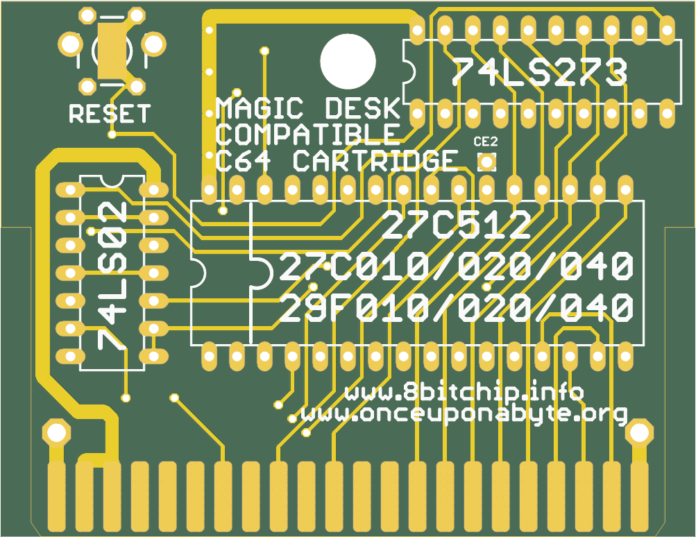

# c64-magic-desk-512k
Hardware design of Magic Desk compatible C64 cartridge for up to 512k (expandable up to 1Mb)

This is the hardware part that accompanies the project of [Magic Desk Cartridge Generator](https://bitbucket.org/zzarko/magic-desk-cartridge-generator/)

You can order these PCBs on [PCBWay](https://www.pcbway.com/project/shareproject/C64_Magic_Desk_512k_Cartridge.html) and help with further C64 hardware development!



Hardware Description
--------------------

Magic Desk cartridges, in their original form, could hold up to 128Kb of code, or up to 16 banks of 8Kb each. Bank selection is done by writing to $DE00. If bit 8 is set, then EXROM is disabled and RAM in the range of $8000 - $9FFF is usable.

This cartridge expands on the idea by having 128 banks of 8Kb available, thus the maximum size is 1 Mb.

Inputs of an 8-bit latch (74LS273) are connected to the data lines. Correct decoding for the I/O1 signal is done by combining PHI2 and I/O1 through the NOR gates of 74LS02. The only feature that is deviant from the original Magic Desk specification, is that when you disable the cartridge by writing a value of $80 or larger to $DE00, the banking mechanism gets locked and no more write attempts to $DE00 will change the register's state until a hardware reset is performed. This had to be done because some programs would unintentionally write to $DE00 (or any other location in the I/O1 range) and sometimes, if $01 is wrongly set by the program, it could result in a crash. Since the use of this particular cartridge is primarily to enable making onefile program compilations, we have decided to do it this way. If you want (or need) full compatibility with the original Magic Desk cartridge hardware, we have left a jumper to disable this behaviour. Cut the track exposed on the LOCK / NO LOCK jumper on the bottom side of the cartridge PCB, and connect it the other way around. This way the locking mechanism is disabled, but still you can remove the cartridge from the memory map by setting the bit 7 of the latch high.

The PCB was designed to accomodate various types of EPROMs and their FLASH variants. The smallest EPROM you can use is 27C512 (64Kb), and the largest is 27C040 (512Kb). There is an option to expand the board to a full 1Mb, which will be explained below.

Jumper configuration
--------------------

In order to support all possible types of EPROMs and FLASH EPROMs, a bank of solder jumpers had to be placed on the bottom side of the PCB. They look like this:

```
JA17 [X X X]       
JA18 [X X X]      
 JF  [X X X]      
JA16 [X X X]
```

These jumpers HAVE to be configured before plugging the cartridge to your C64! Different types of EPROMs and their FLASH variants have some pins swapped, and if you are using a chip smaller than the maximum size, the unused adress lines have to be pulled high on the EPROM side to ensure proper functioning. Also, 27C512 is "shorter" by 4 pins, so its power supply pin must be connected to +5V instead of being allocated as A17 on the larger ones. The rightmost pins of all 4 jumpers are +5V, and the leftmost pins are the address lines. The middle pin of the jumpers are connected according to the table:

| Jumper | Pin | Description                                 |
|--------|-----|---------------------------------------------|
| JA16   | 2   | routes either A16 or VCC to pin 2 of EPROM  |
| JA17   | 30  | routes either A17 or VCC to pin 30 of EPROM |
| JA18   | 1   | routes either A18 or VCC to pin 1 of EPROM  |
| JF     | 31  | routes either A18 or VCC to pin 31 of EPROM |

Here is the table for configuring the jumpers on most common variants of EPROMS and their FLASH counterparts.

```
   27C512          27C010          29F010          27C020          29F020          27C040          29F040
   ------          ------          ------          ------          ------          ------          ------

JA17 [X X=X]    JA17 [X X X]    JA17 [X X X]    JA17 [X=X X]    JA17 [X=X X]    JA17 [X=X X]    JA17 [X=X X]
JA18 [X X X]    JA18 [X X=X]    JA18 [X X X]    JA18 [X X=X]    JA18 [X X=X]    JA18 [X X=X]    JA18 [X=X X]
 JF  [X X X]     JF  [X X=X]     JF  [X X=X]     JF  [X X=X]     JF  [X X=X]     JF  [X=X X]     JF  [X X=X]
JA16 [X X X]    JA16 [X=X X]    JA16 [X=X X]    JA16 [X=X X]    JA16 [X=X X]    JA16 [X=X X]    JA16 [X=X X]
```

Precautions have been taken to ensure the correctness of the table above. Please, check the datasheet of your particular (FLASH) EPROM and configure the jumpers accordingly.

Beyond 512Kb
------------

Full 1Mb is achievable by piggybacking one EPROM to another (essentially making a tower) and should be done only with 27C040 / 29F040 types of memory. Pin 22 of the EPROMs is the only one that should not be connected together. After piggybacking the EPROMs, run a wire from the exposed pad CE2 to pin 22 of the top EPROM. PCB design for a dual EPROM variant will be available soon.

RESET button
------------

The pads for the RESET button will accomodate either a vertical or horizontal miniature tact switch, and the two pads are there to help you to run a wire for a switch if you are putting the PCB in a cartridge case.

Enclosure compatibility
-----------------------

The PCB is designed so it can be used in various types of cartridge cases. It has been designed to fit the original Commodore cases and cases from the Polish companies KRADEX / MASZCZYK which are available at some retailers in Europe. It also fits in a 3D-printed case from the model available at Thingiverse. Unfortunately, we don't have all of the cartridge cases available in the market, so the design is NOT tested to fit with: Individual Computers', TFW8B and Shareware Plus' (and all other currently available) cases. If anyone wants to donate these types of cartridge cases, adjustments to the PCB could be made and a "one board fits all" PCB could be produced.
Please note - the cartridge cases from KRADEX / MASZCZYK are "low profile", and you cannot use a socket for the EPROM with these types of cases!

Copyright
---------

Cartridge schematics and PCB design (c) 2013-2019 Marko Šolajić

Released under GNU General Public License v3.0, see LICENSE file.
